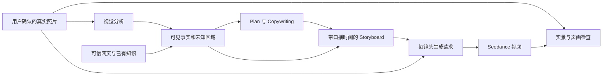

# TravelGen 实景一致性与声画衔接方案

## 1. 建议采用的路线

TravelGen 的目标是根据城市、景点、受众、风格和时长，生成一条可信、好看、能直接播放的浙江文旅宣传片。当前“plan → copywriting → 人工确认 → storyboard → 单 shot 视频”的框架可以保留，接下来应补上两个共同约束：**每个镜头有明确的真实素材依据；整条片子有统一的旁白与剪辑时间轴。**

建议主流程调整为：

```text
首页表单
→ 地点消歧与联网检索
→ 用户选图，形成带来源的项目素材包
→ 根据已有素材生成 plan / copywriting
→ 用户修改文案并试听旁白
→ 生成真实音频、取得字句时间戳
→ 生成绑定旁白区间和参考图的 storyboard
→ 用静图 + 旁白做低成本动态分镜预览
→ 用户确认后生成各 shot
→ 检查实景一致性，按时间轴裁切和排列
→ 统一配乐、混音、字幕、导出成片
```

推荐的第一版组合是：**百度千帆图片检索 + 用户确认 + 每镜头参考图绑定 + Seedance + 独立旁白轨 + FFmpeg 合成**。阿里 IQS 用作搜图对照或补充；已经存在的 Tavily 实验继续作为基线。中文旁白与时间戳可评估 Qwen3-TTS、Qwen3-ForcedAligner；没有适合的推理设备时，也可以先用人工录音或已有云 TTS 完成声音闭环。

这是一份工程设计建议，信息核查截止于 **2026-09-13**。服务额度来自官方公开文档，论文与代码用于解释可借鉴的方法；本文没有执行付费生成，也没有把供应商宣传、论文成绩或本地接口冒烟记录当作本项目的效果测试结果。

### 1.1 对现有问题逐项回答

| 原问题 | 判断 | 建议措施 |
| --- | --- | --- |
| 2.1 模型不知道北山街长什么样 | 地名不能代替真实视觉证据；泛西湖照片也不能证明某段街道 | 联网找候选图，核实地点，用户选图，逐 shot 绑定原图 |
| 2.1 全浙江图片库维护太重 | 不必先穷举全省所有景点 | 小型可靠知识库 + 按需联网 + 经确认素材缓存，逐步积累 |
| 2.1 从哪里找免费、代表性强的图片 | 国内已有提供免费额度的正式搜图 API，但返回结果仍需筛选 | 首测百度图片模态，阿里 IQS 作对照，Commons 与用户原图补充 |
| 2.2 图片先识别成文字是否可行 | 可帮助规划，但文字会丢失大量外观、位置与几何细节 | 同时保留“结构化可见事实”和“原始图片附件”两条通路 |
| 2.3 单段只能生成 4–15 秒 | 这是当前生成片段的约束；成片剪辑时长可以更短 | 区分生成素材与最终使用区间，再由时间轴组织 |
| 2.3.1 Prompt 能否负责衔接 | 可以表达意图，但不能单独保证切镜自然 | 全局视觉规范、切镜类型、可裁剪余量和剪辑检查共同约束 |
| 2.3.2 切镜时旁白是否要暂停 | 不需要；旁白与画面分别占据时间轴 | 旁白按自然语义段生成，可连续跨过多个切点 |
| copywriting 能否直接当旁白 | 可以作为唯一文案来源，但现在的秒数不能当真实发声时间 | 口播化、试听、实测时长、对齐，随后绑定分镜与画面 |
| 如何避免音画各讲各的 | 单纯把文案交给分镜模型还不够 | 用 narration_id、place_id、reference_id 和时间窗建立可检查关系 |

## 2. 当前代码已经有什么，还缺什么

以下以工作区实际代码为准，包括尚未提交的参考图参数和独立实验目录。

| 模块 | 已有能力 | 与本次问题相关的缺口 |
| --- | --- | --- |
| [pipeline.py](D:/code/TravelGen-main/backend/pipeline/pipeline.py:155) | plan、copywriting、storyboard、视频生成与重试 | 没有把参考图和真实旁白时间轴作为分镜的共同输入 |
| [kb.py](D:/code/TravelGen-main/backend/pipeline/kb.py:42) | 关键词检索、文案知识注入、返回参考图列表 | 图片主要作为元数据返回；无法覆盖任意细分地点 |
| [ark_client.py](D:/code/TravelGen-main/backend/pipeline/ark_client.py:35) | 当前工作区已增加 images 参数和 reference_image 附件 | 主流程提交及失败重试仍未传入每个 shot 的参考图；首尾帧等模式也未抽象 |
| [schemas.py](D:/code/TravelGen-main/backend/schemas.py:37) | 可编辑 prompt、时长、主体、背景和机位 | Shot 没有参考素材、口播区间、剪辑区间、前后镜关系字段 |
| [demo.py 的 parse_script](D:/code/TravelGen-main/backend/pipeline/demo.py:31) | 按文案段落 duration_s 累加起止时间 | 这些是模型/文本中的估计时间，不是从音频测量出来的时间戳 |
| [validate.py](D:/code/TravelGen-main/backend/pipeline/validate.py:134) | 结构、枚举、镜头数量和总时长校验 | 不检查地理真实性，也不检查旁白实体是否得到画面支持 |
| [v1_router.py](D:/code/TravelGen-main/backend/v1_router.py:279) | 项目流程、人工确认、单镜重生成；预留 audio/render 接口 | 音频和最终合成仍返回 reserved |
| [RAG_Test/README.md](D:/code/TravelGen-main/RAG_Test/README.md) | 已有带图/纯文本生成对照入口，记录参考图接口可接受 | “更像真实北山街”的对比仍是待验证项；未接主业务 |

这里有三个可以直接利用的起点：

1. [RAG_Test/rag.py](D:/code/TravelGen-main/RAG_Test/rag.py:162) 已有场景登记和文本向量检索。但当前主要索引的是场景名称、说明及 caption，不能因为使用了 vision embedding 模型，就把这段实现说成已经逐图理解了外观。
2. [RAG_Test/tavily_stability.py](D:/code/TravelGen-main/RAG_Test/tavily_stability.py:419) 已实现图片清晰度、近重复、图文/参考图相似度与多样性筛选，可抽取为通用候选图处理模块。它在有人工确认种子图时更有依据；没有种子图的新地点，需要解决冷启动核验。
3. 当前文案 Prompt 对所有 15–120 秒请求都要求“250–300 字”。这个固定字数需要改成与真实口播节奏相关的预算，否则短视频会过密、长视频又可能留出不合理空白。

## 3. 实景图片：联网搜索与按需积累

### 3.1 把“找到图”和“能用图”分成两个判定

搜索接口负责召回候选。后续还要分别回答：图片是否真的是指定地点、是否适合构图、有没有足够分辨率、有没有可执行的使用许可。来源于文旅官网可以提高地点证据的可信度，但不自动意味着图片可直接商用或上传给生成服务；用户勾选也不自动解决授权问题。

每张图建议分开记录：

- `place_match_status`：已确认、待核实、错地点。
- `quality_status`：尺寸、清晰度、拼图/截图、水印、裁切可用性。
- `rights_status`：自有、明确授权、开放许可、待核实；附来源及具体用途。
- `reference_role`：真实地点依据、风格参考、构图参考。

风格参考可以影响色彩和情绪，但不能让它替换真实建筑。是否允许下载缓存、用于模型输入、改编和公开发布，要按对应素材条款分别处理。Commons 也要求逐文件核实许可与署名信息。[9：Commons 复用说明][s09]

### 3.2 搜图服务选择

| 候选 | 实际提供什么 | 官方免费/费用信息 | 建议用途 |
| --- | --- | --- | --- |
| **百度千帆“百度搜索” standard** | 独立 image 搜索模态，可返回图片及来源信息；支持尺寸、比例筛选 | 每月 1500 次，按天约 50 次发放；标准版超额 ¥0.036/次。需账号、API Key，开通条件以控制台为准 | **优先接入的国内候选** |
| **阿里 IQS MultimodalSearch** | 文本搜图，返回 imageItems、来源页、宽高等 | 个人 1000 次、企业 5000 次，均为 15 天试用；基础搜图 ¥25/千次，增强模式另有费用 | 国内对照与补召回 |
| Tavily Search | 网页检索可附查询相关图片及描述；本次核实的是 Search 的 include_images 能力 | 每月 1000 credits；basic 1 credit/次、advanced 2；免费档无需信用卡 | 保留现有实验，也可检索事实来源 |
| Wikimedia Commons | 可通过公开 API、分类和文件信息查询媒体、作者与许可 | 公开 API，不按商业搜索包购买；需遵守访问和限流政策 | 开放许可素材和种子图补充 |
| 博查 Web Search | 中文网页搜索，官方介绍包含图片结果 | 本次未能从可读取的最新官方计费页确认持续免费额度，不列为已确认免费服务 | 暂作文字检索备选 |

来源：[1：百度 API][s01]、[2：百度计费][s02]、[3：IQS 搜图 API][s03]、[4：IQS 计费][s04]、[5：IQS 试用][s05]、[6：Tavily Search][s06]、[7：Tavily 计费][s07]、[8：Commons API][s08]、[25：博查官网][s25]。这张表比较的是可核实能力和费用，不是北山街图片准确率排名。

**实际选择建议：先实现百度一个适配器，再在同一组查询上对比 IQS 与现有 Tavily。** 没必要一开始维护五个供应商。百度具有中文检索和持续免费额度这一组合优势，但最终采用谁，应由地点正确率、用户选中率和稳定性决定。

百度接入时有三个细节：必须明确请求 `image` 模态，否则默认返回网页；多模态筛选目前支持 `standard`，图片 `top_k` 上限为 30；官方 `site` 过滤只对网页和视频生效，图片来源域名筛选需要后处理。不要直接把整段创作要求当 query。[1：百度 API][s01]

还要避免选错产品：百度“图像搜索”中面向自建图库的以图搜图，以及阿里的商品图片搜索，并不等于这里需要的互联网文搜图。上表指定的是千帆百度搜索和 IQS MultimodalSearch。

### 3.3 图片数量够多，代表性才有选择空间

建议采用以下漏斗；数量为第一轮实验的预算起点，不是 API 保证或论文最优值：

```text
精确地点 + 3–4 个不同角度的短查询
→ 召回约 30–60 个候选
→ 原图可达、格式/尺寸检查
→ 完全重复与近重复过滤
→ 地点证据和视觉相关性核验
→ 按整体/街景/可识别局部/细节做覆盖排序
→ 前端展示约 12–20 张
→ 每个地点选定约 3–6 张，单 shot 通常使用 1–3 张
```

以“杭州西湖北山街”为例，可分别搜道路整体、沿街建筑、临湖方向和指定季节。更细的道路别名、建筑名称应来自检索后的核实结果，不能由模型为了丰富内容自行添加。

筛选顺序建议如下：

1. **先确认地点层级。** 保存省/市/景区/道路或建筑的实体关系。“在西湖附近”“从某处拍西湖”和“西湖北山街街景”不能直接合并成一个地点。
2. **做便宜的质量检查。** 获取真实尺寸、解码、模糊度、内容 hash 和感知 hash；缩略图放大不会变成高质量原图。人像、拼贴、海报或浓重文字覆盖应按镜头用途筛掉或单独标注。
3. **再核对来源。** 对照来源页上下文、拍摄对象、明确地标及可用的坐标信息。网页发布日期不等于拍摄日期；EXIF/GPS 可作辅助证据，也可能缺失或不准确。
4. **最后使用视觉模型。** 描述画面内容、找冲突、辅助匹配。图文相似度反映语义接近程度，不能单独证明“这就是北山街”。
5. **按覆盖增益选图。** 十张同一角度的桥，不如整体、建筑、道路、局部各有一张。排序目标应包含新增视角/叙事覆盖，而非仅取最高相似度。

第 5 步可借鉴 Crayotter 的素材覆盖思想：先列出需要的场景与拍摄用途，发现某一类素材不足再补搜。其论文处理的是视频素材，本项目将这个思路迁移到照片候选筛选；这属于工程改造。[17：Crayotter][s17]

不要用“清晰度分数高”替代真实性判断：错误景点的高清图仍然错误；有 AI 风格的图片也不能靠一个检测器就可靠判定真假。

### 3.4 前端选图应该承担的工作

把候选图片卡片放在文案正式确认前。卡片显示原图预览、来源、实际拍摄对象、尺寸、时间信息及许可状态，并允许标记“不是这个地方”“只参考风格”和“上传自己的图”。

选图之后，分镜编辑页还应展示“这个 shot 具体用了哪张图”。用户无需理解向量检索，但应能看出某个镜头在拍哪个真实对象。普通用户也可能不熟悉当地，因此人工选择应与来源核验一起使用。

Lovart 的官方说明支持上传参考与用 Mention 指定资产，可借鉴的是这种显式引用和复用交互。本次公开资料不足以确认它内部使用的搜图供应商或排序算法，不据此推测其实现。[10：Lovart 参考素材说明][s10]

### 3.5 从大而全知识库改为小库加项目素材包

建议保留现有可靠事实条目，但停止以“预先收齐全浙江图片”为前提。新请求先查已确认缓存，缺什么再检索；只有地点和用途得到核实的资产才沉淀。

项目素材包至少包含地点实体、事实来源、选定图片、可见内容、授权信息和拍摄条件。文本事实与视觉素材分开存放，用 `place_id` 联系；候选图可以暂存，不能未经确认直接污染长期库。

Commons 已有北山路相关分类，是可补充的实际线索。但其中“保俶路近北山街”的照片不能仅凭标题包含北山街就改标成北山街道路本身。这种相邻地点混淆，应成为测试集的一类。[26：北山路分类与相邻道路样例][s26]

## 4. 参考图怎样施用于生成管线

### 4.1 视觉描述与像素参考同时保留

“图片 → 视觉模型 → 文字 → shot Prompt”这条路线值得做，但必须保留原图。文字适合表达画面中的对象、关系和限制，原图提供外观、纹理、位置和构图信息。

参考条件已经是可运行视频模型的一类能力：VACE 将参考图、视频和其他条件用于生成/编辑；StoryMem 则使用历史关键帧作为跨镜头记忆。它们说明视觉条件值得明确建模，但不能证明某个闭源服务会准确还原所有真实景点。[15：VACE][s15]、[16：StoryMem][s16]



图中的“可信网页与已有知识”用于补充事实，但在数据结构中应与视觉观察分栏保存，避免混成无法追溯的描述。

### 4.2 把图片分析成可检查的记录

建议让视觉模型输出 `observed_visuals`，明确区分可见、推测和未知。下面是结构示例，内容不是对北山街实景的调查结论：

```json
{
  "asset_id": "ref_014",
  "place_id": "poi_beishan_segment_a",
  "place_match_status": "confirmed",
  "source_page_id": "source_003",
  "observed_visuals": {
    "objects": ["按原图填写可见建筑、道路、水面等"],
    "spatial_relations": ["按该机位填写左/右、近/远关系"],
    "readable_text": [],
    "season": "unknown"
  },
  "must_preserve": ["经确认建筑的轮廓、开窗布局和相对位置"],
  "unknown_or_hidden": ["建筑背面", "画面外道路布局"],
  "allowed_motion": ["固定机位", "小幅推近"],
  "rights_status": "permission_verified"
}
```

“图上有树”不等于能确认树种；“建筑看起来很旧”不等于能确认年代；“远处有塔”也不等于模型知道塔名。这些需要单独的事实来源。不同机位下左右关系会改变，不能把一个画面的左/右强行写成整个景点的永久空间规则。

有明确输入记录以后，各环节的职责可以收紧：

| 环节 | 应获得的依据 | 应输出的约束 |
| --- | --- | --- |
| Plan | 表单、地点范围、事实条目、素材覆盖 | 讲哪些主题；每段是否有素材；缺什么图 |
| Copywriting | 已核实事实、受众、计划、可呈现画面 | 可口播文案；稳定句子 ID；事实和地点引用 |
| Storyboard | 确认文案、真实发声时间、参考图说明 | 每镜头的时间槽、地点、画面任务、参考图 ID |
| Shot 请求 | 单镜主图、辅助图、保留项、允许运动 | 真正带有图片附件的模型请求 |
| QA | 原始参考、已确认文案、生成视频 | 哪些固定结构变化、哪些口播内容没有画面支持 |

Planner 可以写初稿，但涉及具体建筑和镜头的正式方案应经过素材可实现性检查。如果只有街道正面照片，应避免默认安排背面环绕、空中俯冲和连续穿越建筑等需要模型补全未知空间的镜头。

### 4.3 每个 shot 绑定素材，而不是整片共用一堆图

建议为 shot 增加这些信息：

- `place_id`、`reference_asset_ids`：具体地点及所用原图。
- `narration_ids`：覆盖哪些旁白单元。
- `visual_requirement`：本镜头要证明或呈现什么。
- `must_preserve`、`allowed_changes`：固定结构与可变元素。
- `continuity_group`：属于哪个地点/人物/光照连续性组。
- `transition_out`：正常切镜、叠化或连续延展。
- `generation_duration_s` 与 `timeline_range`：生成时长和成片时间槽分别记录。

一张主参考明确构图，少量辅助图补充同一对象的信息。不能把几个不同建筑、不同季节、不同道路段的图一起输入，再期待模型自动知道哪些能组合。

示意 Prompt 可采用以下顺序：

```text
地点：项目中已核实的具体街段。
图片1：本镜头主构图；图片2：同一建筑的可见细节补充。
保持：图片1中建筑外轮廓、道路边界和已有对象的相对位置。
动作：固定机位，只有轻微树叶和行人运动。
画面任务：支持旁白 n03 关于该街段建筑的描述。
限制：不新增塔、桥、牌匾；不展示参考图无法支持的建筑背面。
剪辑：单一镜头，不生成内置字幕或旁白；结尾保持构图稳定。
```

这些约束的遵循程度必须测试。关键实现是把 `reference_asset_ids` 解析为实际附件发送，而不只是让 Prompt 写“参考图片1”。重试时也必须复用同一份参考图、版本和生成模式。

### 4.4 景点真实性应按镜头风险分级

| 镜头类型 | 推荐素材方式 | 原因与代价 |
| --- | --- | --- |
| 特定牌匾、古建立面、具有辨识度的桥塔 | 已授权实拍视频，或真实照片的二维推拉/裁切；必要时小幅 I2V | 对结构变化最敏感，确定性照片运动无需猜背面 |
| 已确认地点内的树影、水波、道路近景 | 参考图 I2V，控制构图与运动幅度 | 允许少量自然变化，更适合发挥视频生成能力 |
| 不承担地点证明的片头、抽象氛围和图形动效 | 可以使用生成或代码动画 | 应与具体实景明确区分 |

不应承诺“纯生成、任意机位、所有地标完全真实”同时成立。若关键地标始终生成不稳，应提供实拍/照片运动回退路径；若项目明确要求全部镜头生成，则应缩小机位与题材范围，并显示尚未通过真实性验收的镜头。

照片运动也有边界：二维平移缩放保留的是原有像素，深度驱动的大幅 2.5D 绕镜和补洞仍会引入推测。清晰招牌、字幕、片名优先由后期叠加，不让视频模型反复绘制精确文字。

### 4.5 生成后的检查不能省略

每条视频先自动抽取首、中、尾及其他关键帧，对照原始参考检查固定结构、明显形变、凭空新增地标和色季冲突，再把高风险镜头交给人看完整视频。抽帧和模型判断都可能漏掉短时异常，因此不是真实性认证。

建议把失败分为“换素材”“降低运动”“局部重生成”“改用实拍/照片运动”，限制单镜重试次数。参考图越差，继续加强 Prompt 或反复付费的收益越不确定。

### 4.6 Seedance 能力边界

字节官方说明 Seedance 2.0 支持多模态参考，包括图片、视频和音频，且能生成短时多镜头内容；这支持继续沿用它做实验。[11：Seedance 2.0 发布说明][s11]

但具体接口能力必须按 **实际 model ID、输入模式和账户权限** 确认。官方产品页写原生 480p/720p，与仓库默认 1080p 存在差异；增强平台的超分输出不能直接当作国内方舟直连的原生能力。[12：Seedance 产品页][s12]

建议维护 `ModelCapabilities`：输入模式、参考图数量、时长范围、分辨率、是否支持关闭音频和返回尾帧。火山官方工具文档也要求按模型支持参数构造请求。[13：火山官方参数参考][s13]

本次未能稳定读取国内方舟完整接口页面，因此不承诺首帧、尾帧和多参考图可以任意混用，也不沿用早期 README 的固定视频单价。当前 `images` 注入路径可先验证，其他模式逐项增加。
